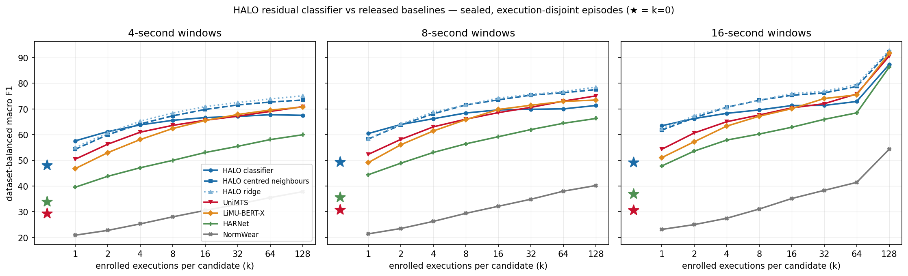

# HALO results record

This is the promoted result record for the current support-conditioned HAR design. Retired
future-JEPA variants are archived separately and are not mixed into this table.

> **Protocol boundary (2026-09-18):** historical tables retain their original artifacts but must
> not be extended with new checkpoints. New runs use `deployment-scenarios-v5-20260918` and
> `sealed-manifest-v2-20260916`, with the restored NumPy manifest draw, corrected k=0 filtering,
> independent enrollment/acquisition sampler, and mandatory companion cosine 1-NN rows. Matched
> comparisons must re-score every checkpoint under one protocol. The v4 table below is historical.

## Fresh HALO evaluation - 2026-09-18 (v5 protocol)

These are the first HALO rows under `deployment-scenarios-v5-20260918` and
`sealed-manifest-v2-20260916`, scored on the same manifests as the fresh baseline artifacts above.
Every sealed cell shared with `baselines_sealed_v5_20260918` (333 of 333) and every scenario cell shared
with `scenarios_baselines_v5_20260918` (737 of 737) carries an identical manifest fingerprint, so the
tables below join the two artifact sets exactly. Nothing here was selected using a sealed number.

**Two arms were trained from scratch on the current sampler**, identical except for the classifier:

| arm | classifier objective | checkpoint SHA-256 | wall time |
|---|---|---|---|
| residual | learned residual support classifier, defaults on (`residual_enabled`, `text_term_enabled`, `centring=support_mean`) | `56b2cb29fdf093bee26292987fae1048b701ef8560643f2e9868d7a7acf5cc74` | 52 min |
| neighbours | parameter-free differentiable-neighbours control | `8d63871eb15557631acbf8caa1cbb4e405297ba3d7146bfd209cec13cb7fcdb3` | 54 min |

Recipe: Stage A curriculum at the trainer defaults, 40,000 optimizer steps, 4 episodes per step, enrollment
counts `{1,2,4,8,16,32}`, acquisition mix 0.5/0.25/0.25, enrollment mix 0.5/0.25/0.25, joint device-set
challenge probability 0.5, up to four devices, seed 20260901, bf16, `--encode-chunk-rows 256`. No rate
augmentation, no gyroscope dropout, no adaptive text gate. Conditioning schema
`acquisition-conditioning-v2`. Trained at `28ff48d` plus the chunking patch, evaluated at `4212cf5` on a
clean tree; the exact configurations are stored as `training_run_config.json` inside each artifact.

**Checkpoint policy.** Both arms report the final step-40,000 checkpoint. This was declared before any
sealed evaluation ran. The enrolled-validation argmax rule that selected earlier checkpoints landed on
step 15,000 for the residual arm, where the enrolled metric oscillated between 70.2 and 76.1 after step
12,500 with no trend while zero-support validation kept rising: the argmax checkpoint scores 76.1 enrolled
and 73.5 zero-support on internal validation, the final checkpoint 72.2 and 81.8. For the neighbours arm the
argmax and the final checkpoint are the same weights. A fixed budget states its stopping rule in advance and
does not reward a lucky validation draw. A companion evaluation of the residual argmax checkpoint was
started and not completed.

**The three HALO variants** requested for this comparison, plus one ablation:

1. residual arm, learned classifier (`halo-classifier`): the shipped default;
2. neighbours arm, cosine 1-NN on its encoder (`1nn`);
3. residual arm, cosine 1-NN on its encoder (`1nn`);
4. ablation: residual arm with the residual and text terms switched off (`halo-classifier-residual-off`).
   This is the same checkpoint and module as (1), keeping only the centred support-vote term, i.e.
   the closed-form floor the learned residual is added to. Earlier sections call it "centred neighbours".

### Sealed aggregate, dataset-balanced macro F1, single-device cells

8-second windows (full `k` grid in the artifacts):

| row | k=0 | k=1 | k=8 | k=32 | k=128 |
|---|---:|---:|---:|---:|---:|
| HALO residual / classifier | **51.7** | **62.4** | 71.5 | 73.4 | 74.4 |
| HALO residual / classifier base (ablation) | - | 60.1 | **73.3** | **77.0** | **78.0** |
| HALO residual / 1-NN | - | 60.7 | 72.0 | 74.8 | 77.1 |
| HALO neighbours / 1-NN | - | 60.3 | 70.6 | 74.0 | 76.0 |
| HALO, either arm / training-bank bridge | 38.6 | - | - | - | - |
| UniMTS / 1-NN (native text at k=0) | 33.1 | 53.9 | 66.9 | 71.5 | 73.9 |
| LiMU-BERT-X / 1-NN (bank bridge at k=0) | 24.9 | 48.2 | 63.9 | 69.0 | 71.2 |
| NormWear / 1-NN (native text at k=0) | 11.6 | 46.3 | 60.6 | 67.1 | 71.5 |
| HARNet-10 / 1-NN (bank bridge at k=0) | 34.4 | 38.8 | 52.1 | 59.6 | 64.5 |
| HARNet-5 / 1-NN (bank bridge at k=0) | 36.0 | 40.8 | 51.1 | 57.0 | 60.7 |

4-second windows:

| row | k=0 | k=1 | k=8 | k=32 | k=128 |
|---|---:|---:|---:|---:|---:|
| HALO residual / classifier | **50.3** | **59.3** | 69.0 | 70.6 | 71.6 |
| HALO residual / classifier base | - | 56.2 | **69.8** | **73.6** | **75.2** |
| HALO residual / 1-NN | - | 57.0 | 68.0 | 71.4 | 73.4 |
| HALO neighbours / 1-NN | - | 57.1 | 67.2 | 70.2 | 72.8 |
| UniMTS / 1-NN | 34.0 | 51.2 | 64.0 | 67.9 | 70.7 |
| LiMU-BERT-X / 1-NN | 24.4 | 45.8 | 60.8 | 65.9 | 68.4 |
| NormWear / 1-NN | 11.7 | 45.1 | 59.2 | 64.4 | 68.8 |
| HARNet-10 / 1-NN | 33.6 | 36.2 | 49.2 | 55.4 | 60.7 |
| HARNet-5 / 1-NN | 34.7 | 35.5 | 46.3 | 52.4 | 56.9 |

16-second windows (`k=128` is MotionSense only at this duration and is omitted):

| row | k=0 | k=1 | k=8 | k=32 | k=64 |
|---|---:|---:|---:|---:|---:|
| HALO residual / classifier | **52.1** | **64.6** | 73.5 | 75.4 | 76.1 |
| HALO residual / classifier base | - | 63.4 | **74.8** | **78.6** | **79.5** |
| HALO residual / 1-NN | - | 64.0 | 73.8 | 77.6 | 78.6 |
| HALO neighbours / 1-NN | - | 63.8 | 72.6 | 76.5 | 77.6 |
| UniMTS / 1-NN | 32.2 | 55.1 | 68.0 | 71.5 | 73.7 |
| LiMU-BERT-X / 1-NN | 24.7 | 49.7 | 64.8 | 71.4 | 72.9 |
| NormWear / 1-NN | 11.0 | 47.0 | 62.4 | 68.3 | 70.8 |
| HARNet-10 / 1-NN | 36.7 | 44.8 | 57.7 | 63.5 | 66.5 |
| HARNet-5 / 1-NN | 35.2 | 41.2 | 52.3 | 58.0 | 60.3 |

Reading these tables:

* **HALO leads every released baseline at every enrollment level and every window.** At 8 s the
  zero-enrollment margin is 15.7 points over the best baseline path (51.7 against HARNet-5's bank bridge
  at 36.0); at one example per class it is 8.5 over UniMTS. Of the 51.7, HALO's own training-bank bridge
  accounts for 38.6, so 13.1 points come from the learned classifier rather than the encoder.
* **The learned residual and text term are net negative above two supports, on their own base.**
  Rows (1) and (4) are one model read out two ways; the base wins by 1.8 at k=8 and 3.6 at k=128 at 8 s,
  and by similar margins at 4 and 16 s. The classifier owns k=0 and k=1; the base owns everything above.
  This reproduces the regression recorded on 2026-09-14. That record attributed it partly to a training
  range that stopped at k=8; this run trained on enrollment counts up to 32 and the regression is
  unchanged, so that explanation is falsified. The remaining suspect is the λ bucket schedule
  `(0,1,2,4,8)`, under which every count from 8 to 128 shares one semantic weight.
* **Training toward the support vote does not produce a better encoder.** Read out identically with
  1-NN, the residual-trained encoder beats the neighbours-trained one at every k (8 s: 60.7/72.0/74.8/77.1
  against 60.3/70.6/74.0/76.0). The centred, temperature-weighted vote of the base is worth about a point
  over plain 1-NN on the same features at k≥2.
* The k=0 bridge values are 38.55 (residual) and 38.64 (neighbours); the per-cell values differ in all
  33 cells and the feature fingerprints differ, so the match is a rounding coincidence, not shared features.

#### Per-dataset decomposition, 8-second windows, macro F1

| dataset | row | k=0 | k=1 | k=8 | k=32 | k=128 |
|---|---|---:|---:|---:|---:|---:|
| MotionSense | classifier | 71.4 | 75.9 | 84.5 | 86.7 | 87.6 |
| MotionSense | classifier base | - | 71.3 | 86.2 | 91.3 | 92.4 |
| MotionSense | residual 1-NN | - | 72.9 | 85.2 | 89.9 | 94.0 |
| MotionSense | neighbours 1-NN | - | 75.1 | 85.5 | 88.9 | 91.4 |
| RealWorld | classifier | 46.9 | 55.4 | 69.1 | 71.4 | 72.3 |
| RealWorld | classifier base | - | 55.8 | 71.1 | 75.6 | 77.3 |
| RealWorld | residual 1-NN | - | 56.2 | 68.9 | 71.0 | 71.3 |
| RealWorld | neighbours 1-NN | - | 55.7 | 68.5 | 71.2 | 72.7 |
| Shoaib | classifier | 72.3 | 84.8 | 90.9 | 91.9 | 92.1 |
| Shoaib | classifier base | - | 80.5 | 91.9 | 93.9 | 94.3 |
| Shoaib | residual 1-NN | - | 81.3 | 91.4 | 92.9 | 93.6 |
| Shoaib | neighbours 1-NN | - | 81.6 | 89.8 | 92.0 | 92.8 |
| InclusiveHAR | classifier | 43.7 | 40.1 | 42.6 | 42.7 | 43.4 |
| InclusiveHAR | classifier base | - | 34.6 | 42.2 | 43.1 | 42.3 |
| InclusiveHAR | residual 1-NN | - | 35.4 | 40.8 | 38.4 | 38.8 |
| InclusiveHAR | neighbours 1-NN | - | 31.9 | 38.0 | 37.6 | 37.7 |
| USC-HAD | classifier | 33.0 | 49.9 | 64.2 | 68.5 | 70.7 |
| USC-HAD | classifier base | - | 52.6 | 68.8 | 75.0 | 77.3 |
| USC-HAD | residual 1-NN | - | 52.1 | 67.6 | 76.4 | 82.1 |
| USC-HAD | neighbours 1-NN | - | 54.9 | 66.7 | 74.9 | 79.8 |
| UT-Complex | classifier | 43.1 | 68.3 | 77.7 | 79.3 | 80.4 |
| UT-Complex | classifier base | - | 66.0 | 79.9 | 83.2 | 84.4 |
| UT-Complex | residual 1-NN | - | 66.4 | 78.0 | 80.3 | 82.6 |
| UT-Complex | neighbours 1-NN | - | 62.7 | 74.8 | 79.6 | 81.7 |

InclusiveHAR stays at or below 44 for every HALO readout, as it does for every released baseline; it is
the one sealed source where enrollment barely helps anyone.

#### Multi-device composite cells, 8-second windows, macro F1 (k=1 / 8 / 32)

| dataset | HALO classifier | HALO classifier base | HALO residual 1-NN | HALO neighbours 1-NN | UniMTS native | NormWear native |
|---|---|---|---|---|---|---|
| RealWorld, all devices | 61.1 / 73.2 / 74.3 | 60.7 / 77.5 / 80.9 | 61.4 / 75.3 / 77.5 | 63.2 / 76.6 / 79.1 | 53.8 / 69.7 / 74.4 | 47.9 / 63.9 / 67.7 |
| Shoaib, all devices | 89.9 / 94.5 / 95.1 | 89.7 / 97.0 / 98.1 | 90.3 / 97.6 / 98.3 | 89.4 / 95.3 / 95.6 | 79.5 / 93.2 / 96.3 | 80.2 / 93.4 / 95.1 |

### Deployment scenarios, 8-second windows, macro F1

Mean over primary variant cells (matched controls excluded, whole-query split, cross-subject or the
published participant split). The baseline column is the strongest released model under cosine 1-NN,
named per row; at k=0 it is the strongest baseline path of any kind.

| scenario | k | HALO classifier | HALO residual 1-NN | HALO neighbours 1-NN | best baseline |
|---|---:|---:|---:|---:|---|
| partial coverage | 1 | **56.7** | 29.3 | 29.4 | 37.8 HARNet fusion; 26.4 UniMTS 1-NN |
| partial coverage | 8 | **57.2** | 31.8 | 31.0 | 38.4 HARNet-10 fusion; 30.4 UniMTS 1-NN |
| partial coverage | 32 | **57.4** | 32.4 | 31.5 | 38.7 HARNet-10 fusion; 31.0 UniMTS 1-NN |
| cross placement | 0 | **42.2** | - | 30.2 (bridge) | 28.4 HARNet-10 fusion |
| cross placement | 1 | **48.0** | 43.9 | 44.0 | 38.8 UniMTS |
| cross placement | 8 | **50.5** | 48.5 | 48.2 | 43.8 UniMTS |
| cross placement | 32 | **50.9** | 48.8 | 48.5 | 44.8 UniMTS |
| cross dataset | 0 | **74.1** | - | 27.0 (bridge) | 26.3 LiMU-BERT-X fusion |
| cross dataset | 1 | **76.8** | 72.0 | 74.1 | 62.6 UniMTS |
| cross dataset | 8 | **83.3** | 81.7 | 80.4 | 72.1 UniMTS |
| cross dataset | 32 | **84.7** | 84.0 | 82.3 | 74.5 UniMTS |
| missing modality | 1 | **60.3** | 58.0 | 57.0 | 57.6 UniMTS |
| missing modality | 8 | 67.5 | 67.7 | 65.2 | **71.3** UniMTS |
| missing modality | 32 | 68.5 | 70.1 | 67.1 | **74.8** UniMTS |
| rate mismatch | 1 | **64.9** | 61.6 | 59.9 | 57.8 UniMTS |
| rate mismatch | 8 | **72.7** | 71.9 | 68.6 | 71.1 UniMTS |
| rate mismatch | 32 | 74.1 | 73.7 | 70.3 | **74.3** UniMTS |
| new domain (MM-Fit) | 0 | 6.6 | - | 5.6 (bridge) | **14.7** UniMTS native |
| new domain (MM-Fit) | 1 | 46.3 | 46.2 | 47.1 | **54.7** LiMU-BERT-X |
| new domain (MM-Fit) | 8 | 57.9 | 57.7 | 57.3 | 57.9 LiMU-BERT-X |
| new domain (MM-Fit) | 32 | **60.6** | 57.5 | 59.5 | 59.2 LiMU-BERT-X |
| device set | 0 | **47.6** | - | 31.5 (bridge, 3 cells) | 34.2 UniMTS fusion |
| device set | 1 | **58.8** | 58.3 | 57.7 | 49.1 UniMTS |
| device set | 8 | **65.7** | 65.6 | 64.6 | 56.3 UniMTS |
| device set | 32 | 66.7 | **66.9** | 66.3 | 57.6 UniMTS |

Cost of each mismatch, scenario minus its exact matched control on the same queries and support
counts, macro F1 at k=8 (subject-paired; more negative is worse):

| scenario | HALO classifier | HALO residual 1-NN | HALO neighbours 1-NN | UniMTS 1-NN | HARNet-10 1-NN |
|---|---:|---:|---:|---:|---:|
| cross placement (30 pairs) | -24.8 | -27.3 | -26.7 | -26.9 | -18.2 |
| cross dataset (8) | -4.6 | -7.4 | -8.3 | -13.4 | -7.0 |
| missing modality (21) | -10.5 | -12.2 | -13.1 | 0.0 | 0.0 |
| rate mismatch (20) | -4.4 | -7.3 | -9.2 | -1.2 | -5.3 |
| device set (55) | -13.2 | -14.6 | -14.7 | -17.9 | -10.2 |

Reading the scenario tables:

* **Partial coverage is the largest lead** and it comes from naming candidates that carry no enrolled
  example, which cosine 1-NN structurally cannot do (its truth-unenrolled split is 0.0 by construction).
* **Cross placement has flipped.** The 2026-09-17 checkpoint trailed UniMTS 1-NN by 3.2 at k=8 on the
  v4 manifests; this checkpoint leads by 6.7, and it is the only model with a zero-enrollment row above
  the fusion floor. The paired cost is still large for everyone; HARNet-10 pays least in absolute terms
  from a much lower matched control.
* **Missing modality remains the one loss above k=1**, and its paired-cost row shows why the comparison
  is asymmetric: HARNet and UniMTS are accelerometer-only, so removing the gyroscope changes nothing for
  them (cost exactly 0.0), while HALO genuinely loses a modality (-10.5). LiMU-BERT-X declares the
  condition unsupported.
* **Rate mismatch** costs HALO's classifier 4.4 points against UniMTS's 1.2; LiMU-BERT-X is unaffected by
  construction because its released contract resamples every input to a fixed clock.
* **New domain is where the open-vocabulary claim stops.** MM-Fit's ten gym exercises are not in the
  training vocabulary. At zero enrollment the classifier is at chance (6.6 macro F1, 9.6% accuracy over
  ten classes). One example per class lifts it to 62.6 and eight to 81.8 on the matched-placement cell,
  so the encoder represents these movements; the language interface does not. On the partial-coverage
  variant, queries whose truth is unenrolled score 1.7 at k=8 against 55.6 when it is enrolled. The
  scenario has two MM-Fit cells and no other source, so its aggregate is thin.
* **Foreign vocabulary and acquisition mismatch compound.** MM-Fit also appears inside cross placement
  and device set. Under device-set mismatch HALO still leads on MM-Fit (45.8 against UniMTS 41.0 at
  k=8), but far below its familiar-vocabulary cells (77.1). Under cross placement on MM-Fit every model
  sits between 12 and 25 at every k, HALO is flat at about 19.5 from k=1 to k=32, and HARNet-10 and
  UniMTS edge ahead at high k. Enrolling a gym exercise at the wrist and deploying at the ear or pocket
  appears close to physically ill-posed; the failure is universal but HALO does not lead it.
* Zero-support rows for the neighbours arm use the training-bank bridge and are much weaker (30.2,
  27.0, 31.5) than the residual classifier's semantic path (42.2, 74.1, 47.6); that arm never trains on
  zero-support episodes, so its zero-support validation is undefined by design.

### Limitations of this record

* The HALO checkpoints carry `acquisition-conditioning-v2`; every HALO row in the older sections below
  was trained under the combined-text scheme. These are fresh measurements, not re-scorings, and must
  not be mixed with those rows.
* Training used row-chunked collation. The dense collate pads each sub-batch to its widest row, so batch
  composition influences encoder outputs; chunking at a fixed size is deterministic and reproducible but
  not bit-identical to an unchunked run. The sensitivity predates chunking and is unresolved.
* Checkpoint selection on the enrolled-validation argmax is inside noise after ~12,500 steps; the fixed
  budget above replaces it for these rows. The argmax companion was not completed.
* `k=128` at 16 s is MotionSense only. The new-domain scenario is two MM-Fit cells. Same-subject
  cross-placement cells are excluded from the scenario means as too thin to cite.

Artifacts, each with `README.md`, the generated `RESULTS.md`, the compressed row payload and manifests,
`training_run_config.json`, and uncompressed hashes:
[`halo_residual_sealed_v5_20260918`](../../results/artifacts/halo_residual_sealed_v5_20260918/),
[`halo_residual_scenarios_v5_20260918`](../../results/artifacts/halo_residual_scenarios_v5_20260918/),
[`halo_neighbors_sealed_v5_20260918`](../../results/artifacts/halo_neighbors_sealed_v5_20260918/),
[`halo_neighbors_scenarios_v5_20260918`](../../results/artifacts/halo_neighbors_scenarios_v5_20260918/).

## Fresh baseline scenario artifact - 2026-09-18

The current `deployment-scenarios-v5-20260918` baseline-only run completed successfully before
any new HALO run: five released baseline providers, seven active scenarios, one 8-second evidence
duration, and `k={0,1,4,8,32}`. It produced 11,211 rows across 1,132 scored task units with zero
task failures and zero failed rows. Explicit unsupported rows are retained rather than repaired
with project-specific adapter logic.

This is a durable baseline reference, not a HALO comparison table. A matched fresh HALO scenario
run is required before presenting a new scenario head-to-head claim.
The generated table and its complete machine-readable provenance are in
[`results/artifacts/scenarios_baselines_v5_20260918`](../../results/artifacts/scenarios_baselines_v5_20260918/).

## Fresh baseline aggregate artifact - 2026-09-18

The current baseline-only sealed evaluation completed all 39 protocol cells in 42.0 minutes. It
covers the six sealed datasets, 4/8/16-second windows, and
`k={0,1,2,4,8,16,32,64,128}` for all five retained released baselines. The artifact contains
3,354 successful metric rows and 213 explicit unsupported rows, with no failed rows. For enrolled
cells it retains both cosine 1-NN and equal-weight normalized fusion; zero-support cells retain the
available native or training-bank/ConSE paths and the declared fusion path.

These are fresh baseline numbers only. They replace the stale baseline side of the historical
sealed table below, but must not be combined with its old HALO rows. A current HALO checkpoint must
be scored on the same manifests before a new aggregate head-to-head table is promoted. The complete
per-dataset table, confidence intervals, manifests, hashes, and machine-readable rows are in
[`results/artifacts/baselines_sealed_v5_20260918`](../../results/artifacts/baselines_sealed_v5_20260918/).

## Representative scenario protocol - 2026-09-17

Deployment scenarios are a fixed set of seven stress tests, not a full Cartesian sweep. The
completed run uses every scenario at `k=0`, `k=1`, `k=4`, `k=8`, and `k=32` with an 8-second
analysis window. It evaluates HALO and the five retained baselines (`HARNet-5`, `HARNet-10`,
`LiMU-BERT-X`, `UniMTS`, and `NormWear`) on identical episodes. HALO uses its learned classifier;
external encoders use the fixed equal-weight normalized fusion adapter. The complete run contains
4,341 promoted result rows after excluding the retired cold-start condition. The immutable source
artifact contains 65 additional cold-start rows retained only for reproducibility.

The ordinary sealed evaluation is separate and may use the larger `k=0..64`, 4/8/16-second grid.
Do not multiply that sealed grid into the scenario experiment: `7 scenarios x 8 k values x 3
windows x all dataset variants` is an exploratory Cartesian sweep, not the representative
scenario protocol. Such exploratory runs must use a separate output directory and must not
replace the representative tables.

The concise results, readout-fairness diagnostic, limitations, hashes, and tracked machine-readable
artifacts are in the
[2026-09-17 scenario results](../journal/2026-09-17-scenario-evaluation-results.md). The original local
run is preserved under `cache/evaluations/`; the promoted machine-readable subset is
[`results/artifacts/scenarios_halo_classifier_v3_20260917`](../../results/artifacts/scenarios_halo_classifier_v3_20260917/).

Every scenario run writes `progress.json` after each scored task. It records exact completed and
total protocol cells, progress within the current cell, elapsed time, a rolling task rate, ETA,
episode-construction time, and cumulative time attributed to each model. Console `[progress]`
lines mirror the durable file. Use these measurements for status and duration estimates; counting
plain `[scenarios]` log lines is not a reliable ETA because multi-device tasks are substantially
more expensive than ordinary cached cells.

## Deployment-scenario diagnostics - 2026-09-16

The Stage A acquisition/enrollment curriculum is reported separately from the ordinary sealed
k-curve because it historically tested eight perturbed deployment conditions. Cold start is now
retired; active v4 runs test the seven nonredundant conditions. The concise summary contains a
scenario glossary, aggregate comparisons against every released baseline, and per-dataset tables;
the adjacent exhaustive artifact retains every split, readout, and confidence interval:

- [Stage A scenario summary](../../results/artifacts/historical-evaluations/scenarios_curriculum12_20260916/SUMMARY.md)
- [Stage A exhaustive scenario results](../../results/artifacts/historical-evaluations/scenarios_curriculum12_20260916/RESULTS.md)

These rows use the same immutable manifests as the released-baseline scenario run. They are not
mixed numerically with the ordinary 4/8/16-second sealed comparison below. In the scenario summary,
`HALO 1-NN` is a diagnostic readout of the encoder jointly trained with the residual classifier;
it is not the older differentiable-neighbours-trained encoder.

## Historical sealed comparison - 2026-09-14

This table predates the current v5 protocol and must not be extended with new checkpoints. It
evaluates the validation-selected checkpoint from
the direct end-to-end fixed multi-resolution filterbank run with the **learned residual support
classifier**: 8-second training windows, `0.5/1/2/4 s` patch durations, gravity-referenced
polarization features, multi-device training. The encoder has **0.789M parameters**; the learned
classifier adds **1.41M** (2.203M total on classifier rows). Evaluation uses immutable,
execution-disjoint episodes identical for every provider, at three evidence durations. No sealed
result selected the checkpoint.

Full per-dataset matrices for all `k` and every readout, with confidence intervals, device
disclosures and padding flags, are in
[the canonical combined artifact](../../results/artifacts/historical-evaluations/sealed_comparison_residual_v3_8s_4res_40k_20260914/combined/RESULTS.md).

Dataset-balanced macro F1, single-device cells. HALO rows name their readout: `classifier` is the
learned head; `centred neighbours` is the same head with the residual and text term disabled, which
is exactly centred differentiable neighbours and is HALO's parameter-free floor. Baselines use the
shared 1-NN readout; at `k=0` each model uses its disclosed zero-support path.

| window | model / readout | k=0 | k=1 | k=8 | k=32 | k=128 |
|---|---|---:|---:|---:|---:|---:|
| 4 s | HALO / classifier | **48.1** | **57.6** | 65.6 | 67.1 | 67.5 |
| 4 s | HALO / centred neighbours | - | 54.3 | 67.3 | 71.6 | 73.5 |
| 4 s | UniMTS / 1-NN | 29.3 | 50.4 | 63.6 | 67.2 | 70.9 |
| 4 s | LiMU-BERT-X / 1-NN | - | 46.8 | 62.4 | 67.9 | 70.7 |
| 4 s | HARNet / 1-NN | 33.8 | 39.5 | 50.0 | 55.5 | 60.0 |
| 4 s | NormWear / 1-NN | - | 20.9 | 28.0 | 32.9 | 37.8 |
| 8 s | HALO / classifier | **49.3** | **60.5** | 68.4 | 69.9 | 71.3 |
| 8 s | HALO / centred neighbours | - | 58.3 | 71.6 | 75.4 | 77.5 |
| 8 s | UniMTS / 1-NN | 30.7 | 52.4 | 66.0 | 70.6 | 75.1 |
| 8 s | LiMU-BERT-X / 1-NN | - | 49.2 | 65.9 | 71.4 | 73.5 |
| 8 s | HARNet / 1-NN | 35.6 | 44.4 | 56.4 | 62.0 | 66.3 |
| 8 s | NormWear / 1-NN | 3.5 | 21.4 | 29.4 | 34.9 | 40.2 |
| 16 s | HALO / classifier | **49.2** | **63.5** | 69.6 | 71.4 | 87.3 |
| 16 s | HALO / centred neighbours | - | 61.7 | 73.4 | 76.2 | 92.2 |
| 16 s | UniMTS / 1-NN | 30.6 | 54.3 | 67.7 | 72.1 | 90.6 |
| 16 s | LiMU-BERT-X / 1-NN | - | 51.0 | 67.2 | 74.0 | 91.7 |
| 16 s | HARNet / 1-NN | 36.9 | 47.8 | 60.2 | 66.0 | 86.3 |
| 16 s | NormWear / 1-NN | - | 23.1 | 31.1 | 38.3 | 54.3 |

### Per-dataset decomposition

These are the existing single-device rows underlying the aggregate table above, not a new
evaluation. Where a dataset has multiple eligible placements, its entry is the mean across those
placements, matching the aggregate calculation. `—` means that the cell was unavailable. These
2026-09-14 baseline rows predate the 2026-09-16 baseline-fidelity repairs and will be replaced after
the next full baseline evaluation; they are retained here only to decompose the reported aggregate.

#### 4-second windows: macro F1

| dataset | model / readout | k=0 | k=1 | k=8 | k=32 | k=128 |
|---|---|---:|---:|---:|---:|---:|
| MotionSense | HALO / classifier | 67.8 | 71.5 | 79.2 | 82.4 | 83.5 |
| MotionSense | HALO / centred neighbours | — | 66.0 | 79.7 | 85.6 | 88.7 |
| MotionSense | UniMTS / 1-NN | 38.0 | 64.5 | 80.3 | 85.2 | 89.6 |
| MotionSense | LiMU-BERT-X / 1-NN | 40.9 | 53.1 | 74.6 | 81.6 | 86.6 |
| MotionSense | HARNet / 1-NN | 46.7 | 49.4 | 62.3 | 70.4 | 75.7 |
| MotionSense | NormWear / 1-NN | 6.3 | 23.9 | 31.0 | 37.6 | 44.1 |
| RealWorld | HALO / classifier | 43.7 | 50.7 | 62.9 | 64.4 | 63.5 |
| RealWorld | HALO / centred neighbours | — | 48.8 | 65.2 | 69.6 | 71.7 |
| RealWorld | UniMTS / 1-NN | 29.2 | 49.4 | 62.4 | 64.4 | 67.0 |
| RealWorld | LiMU-BERT-X / 1-NN | — | — | — | — | — |
| RealWorld | HARNet / 1-NN | 25.4 | 33.4 | 43.5 | 48.6 | 51.9 |
| RealWorld | NormWear / 1-NN | 3.5 | 21.2 | 26.7 | 30.1 | 32.4 |
| Shoaib | HALO / classifier | 67.7 | 79.0 | 85.5 | 86.3 | 87.0 |
| Shoaib | HALO / centred neighbours | — | 73.5 | 85.9 | 88.5 | 89.5 |
| Shoaib | UniMTS / 1-NN | 36.8 | 71.6 | 86.1 | 89.5 | 91.4 |
| Shoaib | LiMU-BERT-X / 1-NN | 28.6 | 64.5 | 79.8 | 82.3 | 83.2 |
| Shoaib | HARNet / 1-NN | 48.0 | 54.3 | 69.1 | 75.0 | 80.5 |
| Shoaib | NormWear / 1-NN | 3.6 | 23.6 | 34.1 | 43.0 | 50.4 |
| InclusiveHAR | HALO / classifier | 36.5 | 34.8 | 37.6 | 36.1 | 36.4 |
| InclusiveHAR | HALO / centred neighbours | — | 31.0 | 36.4 | 37.6 | 38.5 |
| InclusiveHAR | UniMTS / 1-NN | 25.3 | 33.8 | 41.9 | 40.6 | 43.0 |
| InclusiveHAR | LiMU-BERT-X / 1-NN | 27.8 | 22.8 | 27.2 | 28.6 | 28.1 |
| InclusiveHAR | HARNet / 1-NN | 25.0 | 30.2 | 29.5 | 28.7 | 30.2 |
| InclusiveHAR | NormWear / 1-NN | 4.8 | 23.3 | 25.4 | 24.2 | 27.4 |
| USC-HAD | HALO / classifier | 34.8 | 50.7 | 57.8 | 59.8 | 60.4 |
| USC-HAD | HALO / centred neighbours | — | 50.4 | 64.7 | 70.1 | 72.9 |
| USC-HAD | UniMTS / 1-NN | 24.9 | 40.8 | 55.3 | 62.5 | 69.2 |
| USC-HAD | LiMU-BERT-X / 1-NN | 12.8 | 44.6 | 64.9 | 74.3 | 79.7 |
| USC-HAD | HARNet / 1-NN | 23.6 | 29.9 | 42.3 | 49.8 | 57.2 |
| USC-HAD | NormWear / 1-NN | 1.4 | 15.0 | 21.9 | 26.4 | 31.0 |
| UT-Complex | HALO / classifier | 38.1 | 58.8 | 70.7 | 73.6 | 74.5 |
| UT-Complex | HALO / centred neighbours | — | 56.1 | 72.0 | 77.9 | 79.7 |
| UT-Complex | UniMTS / 1-NN | 21.8 | 42.6 | 55.8 | 60.9 | 65.2 |
| UT-Complex | LiMU-BERT-X / 1-NN | 9.6 | 48.9 | 65.5 | 72.5 | 76.2 |
| UT-Complex | HARNet / 1-NN | 34.0 | 39.9 | 53.4 | 60.3 | 64.3 |
| UT-Complex | NormWear / 1-NN | 1.1 | 18.2 | 28.9 | 36.1 | 41.6 |

#### 8-second windows: macro F1

| dataset | model / readout | k=0 | k=1 | k=8 | k=32 | k=128 |
|---|---|---:|---:|---:|---:|---:|
| MotionSense | HALO / classifier | 69.9 | 74.6 | 84.1 | 85.2 | 86.2 |
| MotionSense | HALO / centred neighbours | — | 70.3 | 85.6 | 90.1 | 91.8 |
| MotionSense | UniMTS / 1-NN | 36.1 | 67.6 | 83.0 | 88.8 | 90.7 |
| MotionSense | LiMU-BERT-X / 1-NN | 43.1 | 53.3 | 78.8 | 85.9 | 89.3 |
| MotionSense | HARNet / 1-NN | 51.7 | 58.4 | 71.4 | 78.5 | 82.8 |
| MotionSense | NormWear / 1-NN | 6.2 | 20.9 | 31.3 | 40.9 | 48.5 |
| RealWorld | HALO / classifier | 44.3 | 51.7 | 65.0 | 67.0 | 73.5 |
| RealWorld | HALO / centred neighbours | — | 51.1 | 68.8 | 72.1 | 80.6 |
| RealWorld | UniMTS / 1-NN | 30.5 | 51.3 | 66.0 | 68.4 | 77.2 |
| RealWorld | LiMU-BERT-X / 1-NN | — | — | — | — | — |
| RealWorld | HARNet / 1-NN | 28.3 | 37.7 | 48.5 | 53.4 | 61.9 |
| RealWorld | NormWear / 1-NN | 3.6 | 18.9 | 25.0 | 28.7 | 32.3 |
| Shoaib | HALO / classifier | 68.7 | 82.6 | 88.1 | 89.4 | 89.6 |
| Shoaib | HALO / centred neighbours | — | 78.6 | 89.7 | 91.6 | 92.1 |
| Shoaib | UniMTS / 1-NN | 37.6 | 73.8 | 88.9 | 91.8 | 93.5 |
| Shoaib | LiMU-BERT-X / 1-NN | 28.9 | 69.7 | 85.5 | 87.5 | 87.2 |
| Shoaib | HARNet / 1-NN | 46.3 | 61.3 | 76.6 | 82.1 | 86.6 |
| Shoaib | NormWear / 1-NN | 3.6 | 25.3 | 38.4 | 47.8 | 54.3 |
| InclusiveHAR | HALO / classifier | 36.6 | 35.2 | 37.6 | 36.8 | 36.5 |
| InclusiveHAR | HALO / centred neighbours | — | 32.2 | 38.7 | 41.0 | 40.9 |
| InclusiveHAR | UniMTS / 1-NN | 31.6 | 32.1 | 37.6 | 39.1 | 41.3 |
| InclusiveHAR | LiMU-BERT-X / 1-NN | 28.0 | 23.8 | 27.0 | 27.9 | 27.1 |
| InclusiveHAR | HARNet / 1-NN | 26.2 | 28.6 | 30.3 | 30.5 | 29.5 |
| InclusiveHAR | NormWear / 1-NN | 4.8 | 23.5 | 23.4 | 23.6 | 26.0 |
| USC-HAD | HALO / classifier | 35.4 | 53.1 | 59.3 | 61.5 | 62.3 |
| USC-HAD | HALO / centred neighbours | — | 53.9 | 68.2 | 73.7 | 75.1 |
| USC-HAD | UniMTS / 1-NN | 26.5 | 38.9 | 55.2 | 66.7 | 74.8 |
| USC-HAD | LiMU-BERT-X / 1-NN | 12.6 | 45.4 | 66.5 | 77.7 | 82.0 |
| USC-HAD | HARNet / 1-NN | 27.4 | 33.1 | 48.7 | 58.3 | 64.4 |
| USC-HAD | NormWear / 1-NN | 1.4 | 16.2 | 24.7 | 28.9 | 35.3 |
| UT-Complex | HALO / classifier | 40.8 | 65.5 | 76.7 | 79.4 | 79.8 |
| UT-Complex | HALO / centred neighbours | — | 63.9 | 78.4 | 83.9 | 84.7 |
| UT-Complex | UniMTS / 1-NN | 21.8 | 50.3 | 65.5 | 68.9 | 73.1 |
| UT-Complex | LiMU-BERT-X / 1-NN | 9.5 | 53.7 | 71.6 | 78.2 | 81.7 |
| UT-Complex | HARNet / 1-NN | 33.6 | 47.5 | 63.2 | 69.1 | 72.6 |
| UT-Complex | NormWear / 1-NN | 1.1 | 23.5 | 33.5 | 39.3 | 44.9 |

#### 16-second windows: macro F1

| dataset | model / readout | k=0 | k=1 | k=8 | k=32 | k=128 |
|---|---|---:|---:|---:|---:|---:|
| MotionSense | HALO / classifier | 70.0 | 76.3 | 83.7 | 86.1 | 87.3 |
| MotionSense | HALO / centred neighbours | — | 72.6 | 85.8 | 90.6 | 92.2 |
| MotionSense | UniMTS / 1-NN | 43.3 | 68.4 | 84.1 | 87.4 | 90.6 |
| MotionSense | LiMU-BERT-X / 1-NN | 42.7 | 56.0 | 78.4 | 87.6 | 91.7 |
| MotionSense | HARNet / 1-NN | 50.4 | 61.3 | 75.6 | 83.9 | 86.3 |
| MotionSense | NormWear / 1-NN | 6.1 | 24.8 | 32.6 | 43.6 | 54.3 |
| RealWorld | HALO / classifier | 44.3 | 54.2 | 67.0 | 67.3 | — |
| RealWorld | HALO / centred neighbours | — | 54.0 | 70.7 | 70.1 | — |
| RealWorld | UniMTS / 1-NN | 31.2 | 53.5 | 67.6 | 67.3 | — |
| RealWorld | LiMU-BERT-X / 1-NN | — | — | — | — | — |
| RealWorld | HARNet / 1-NN | 29.3 | 41.4 | 52.1 | 56.3 | — |
| RealWorld | NormWear / 1-NN | 3.6 | 19.2 | 26.0 | 30.3 | — |
| Shoaib | HALO / classifier | 68.5 | 83.9 | 89.4 | 90.6 | — |
| Shoaib | HALO / centred neighbours | — | 80.9 | 91.4 | 92.8 | — |
| Shoaib | UniMTS / 1-NN | 38.2 | 72.9 | 88.7 | 92.1 | — |
| Shoaib | LiMU-BERT-X / 1-NN | 28.8 | 69.8 | 86.3 | 89.1 | — |
| Shoaib | HARNet / 1-NN | 48.8 | 65.6 | 81.6 | 87.0 | — |
| Shoaib | NormWear / 1-NN | 3.6 | 26.4 | 40.9 | 50.5 | — |
| InclusiveHAR | HALO / classifier | 36.8 | 38.0 | 35.7 | 36.0 | — |
| InclusiveHAR | HALO / centred neighbours | — | 34.2 | 37.8 | 40.0 | — |
| InclusiveHAR | UniMTS / 1-NN | 26.7 | 34.7 | 36.3 | 40.7 | — |
| InclusiveHAR | LiMU-BERT-X / 1-NN | 28.0 | 24.5 | 27.4 | 31.3 | — |
| InclusiveHAR | HARNet / 1-NN | 27.6 | 28.7 | 29.7 | 27.5 | — |
| InclusiveHAR | NormWear / 1-NN | 4.9 | 24.3 | 23.4 | 24.8 | — |
| USC-HAD | HALO / classifier | 35.8 | 53.6 | 60.1 | 64.2 | — |
| USC-HAD | HALO / centred neighbours | — | 56.6 | 69.6 | 75.8 | — |
| USC-HAD | UniMTS / 1-NN | 25.5 | 39.2 | 57.4 | 68.4 | — |
| USC-HAD | LiMU-BERT-X / 1-NN | 12.8 | 45.6 | 67.5 | 78.8 | — |
| USC-HAD | HARNet / 1-NN | 28.3 | 34.5 | 52.4 | 64.3 | — |
| USC-HAD | NormWear / 1-NN | 2.2 | 17.6 | 25.5 | 33.8 | — |
| UT-Complex | HALO / classifier | 39.9 | 74.8 | 81.9 | 84.2 | — |
| UT-Complex | HALO / centred neighbours | — | 72.2 | 85.1 | 88.1 | — |
| UT-Complex | UniMTS / 1-NN | 18.8 | 57.1 | 71.8 | 76.3 | — |
| UT-Complex | LiMU-BERT-X / 1-NN | 9.1 | 59.3 | 76.4 | 83.5 | — |
| UT-Complex | HARNet / 1-NN | 37.2 | 55.2 | 70.1 | 76.7 | — |
| UT-Complex | NormWear / 1-NN | 1.1 | 26.4 | 37.9 | 46.9 | — |

### Reading this table

* **`k=0` is the headline change.** The learned classifier reaches 49.3 at 8 s against HARNet's
  training-bank bridge at 35.6 and UniMTS's released native text head at 30.7. HALO's own bridge
  scores 38.3, so +11.0 of the gain is the classifier rather than the encoder.
* **`k=1` is the other regime the classifier owns**: at one support per candidate, 1-NN, prototype,
  ridge and the soft vote are mathematically identical, so only a second evidence source can move
  it. 60.5 against 58.6 clears the ~1-point enrollment-draw noise.
* **Above `k=2` the learned residual currently regresses** (−1.9 to −6.3 against centred
  neighbours), traced to a λ schedule whose top bucket covers all `k>=8` and a training range that
  stopped at k=8. Until that is fixed, **centred neighbours is HALO's strongest enrolled readout**
  and is the row to compare against baselines at high k.
* `k=128` at 16 s is **MotionSense only** and is not a six-dataset aggregate.
* Compare within a window duration, never across: query counts differ, so confidence intervals do.

Multi-device composite cells are reported separately in the combined artifact. At 8 s and k=1,
HALO gains **+11.1** (RealWorld) and **+8.9** (Shoaib) over its own single-placement cells, against
UniMTS's native skeleton fusion at +3.7 / +4.1.

**How HALO fuses devices.** One token per `(patch, sensor)`, where a *sensor* is one 3-axis modality
on one device, so an accelerometer and a gyroscope on the same wrist stay separate tokens. Device,
modality and placement identity enter through per-sensor **text** conditioning (axis lives in the
role text, so no fact is injected twice), and a single learned `RecordingAttentionPool` query
attends over every `patch x sensor` token at once. There is no separate device-fusion stage and no
placement-specific parameter: an unseen placement is expressible because identity is text. The pool
is ~0.13M of the 0.789M encoder and is trained end to end with everything else. An earlier version
of this line credited the gain to a parameter-free hierarchical device mean; that path exists in
`encoder.py` but is **overridden** by the learned pool in every trained checkpoint, so it produced
none of the numbers in this file. See
[docs/journal/2026-09-14-multi-device-pooling-correction.md](../journal/2026-09-14-multi-device-pooling-correction.md).

The narrative behind these numbers — why JEPA and the continuous kernel were dropped, what is and
is not a controlled comparison, and the open limitations — is in
[docs/journal/2026-09-14-design-narrative.md](../journal/2026-09-14-design-narrative.md).

**Protocol note.** These numbers use the 4/8/16-second multi-device protocol introduced on
2026-09-13 and are **not comparable** to any result measured under the previous 6-second protocol,
including the tables below and the retired JEPA record. See
[docs/journal/2026-09-14-evaluation-rebuild.md](../journal/2026-09-14-evaluation-rebuild.md).

## Superseded sealed comparison - 2026-09-13

The table below evaluated the same encoder configuration with the parameter-free
differentiable-neighbours control and no learned classifier. It is retained as the immediately
preceding record; its encoder matches the current one under identical readouts (1-NN at 8 s: 59.0
vs 58.6 at k=1, 76.5 vs 77.1 at k=128).

## Historical: sealed enrollment comparison - 2026-09-12 (6-second protocol)

Both metrics are on a 0-100 scale and are averaged equally across the six sealed datasets. Accuracy
is the fraction of correct predictions within each dataset. Macro F1 gives every ground-truth class
equal weight within each dataset, regardless of its frequency. For every `k >= 1`, all rows use the
same parameter-free hard 1-NN classifier and the same deterministic,
execution-disjoint support/query manifests. `k` is the number of enrolled executions **per
candidate label**, so an episode with `C` candidates contains `C * k` supports. At `k=0`, no sealed
target recording is enrolled. HALO, HARNet, and LiMU-BERT-X instead use a labelled reference bank
built only from the eight classifier-training datasets: hard 1-NN predicts a training label and
ConSE bridges that prediction to the sealed candidate vocabulary. UniMTS and NormWear use their
released native text-aligned prediction paths.

"Open-set labels" means that the deployed model can emit labels outside its classifier-training
vocabulary, either from labelled supports or through its semantic bridge. "Native adaptation"
means that the model itself accepts labelled examples at inference. Applying the common 1-NN
evaluator to an external encoder does not turn that encoder into a native adaptation model. The
explicit `k=0 readout` column prevents a shared ConSE bridge from being mistaken for a released
model's native capability.

### Macro F1

| model | parameters | open-set labels | native adaptation | k=0 readout | k=0 | k=1 | k=2 | k=4 | k=8 | k=16 | k=32 | k=64 | k=128 |
|---|---:|:---:|:---:|---|---:|---:|---:|---:|---:|---:|---:|---:|---:|
| HARNet, released | 4.49M | no | no | train-bank 1-NN + ConSE | **36.97** | 42.40 | 46.78 | 50.80 | 53.51 | 56.50 | 59.48 | 61.07 | 63.89 |
| LiMU-BERT-X, released | 0.055M | no | no | train-bank 1-NN + ConSE | 24.97 | 50.37 | 57.17 | 62.03 | 66.50 | 69.61 | 70.98 | 72.42 | 73.53 |
| UniMTS, released | 68.61M | yes | no | native zero-support | 31.61 | 56.08 | 61.73 | 66.22 | 68.83 | 71.44 | 72.92 | 74.05 | 75.57 |
| NormWear, released | 1,293.86M | yes | no | native zero-support | 5.14 | 21.90 | 24.68 | 28.39 | 31.71 | 35.51 | 39.15 | 41.61 | 44.89 |

### Accuracy

| model | k=0 | k=1 | k=2 | k=4 | k=8 | k=16 | k=32 | k=64 | k=128 |
|---|---:|---:|---:|---:|---:|---:|---:|---:|---:|
| HARNet, released | **41.07** | 43.56 | 47.75 | 51.46 | 53.98 | 56.78 | 59.56 | 61.09 | 63.82 |
| LiMU-BERT-X, released | 29.03 | 51.65 | 58.67 | 63.26 | 67.45 | 70.40 | 71.74 | 73.10 | 74.02 |
| UniMTS, released | 39.90 | 55.52 | 61.23 | 65.59 | 68.15 | 70.84 | 72.37 | 73.57 | 75.07 |
| NormWear, released | 15.95 | 22.42 | 25.15 | 28.86 | 32.12 | 35.97 | 39.68 | 42.06 | 45.50 |

Bold identifies the strongest score in each metric column. Promoted HALO rows will be added only
after the current direct end-to-end fixed-filterbank runs are evaluated with these manifests.

## Interpretation

- These are deployed-system comparisons, not parameter- or upstream-data-matched architecture
  ablations. The released models differ substantially in size and pretraining corpus.
- `k=0` does not mean an empty world model. It means zero target-dataset enrollment. The disclosed
  training-bank bridge lets representation-only models participate without fitting on a sealed
  recording, but it is not a native released zero-shot head. HARNet leads this condition at 36.97.

### Zero-target-enrollment results by sealed dataset

All entries are macro F1 on a 0-100 scale. The readout is identified in the main table.

| model | MotionSense | RealWorld | Shoaib | InclusiveHAR | USC-HAD | UT-Complex | equal-dataset mean |
|---|---:|---:|---:|---:|---:|---:|---:|
| HARNet, released | **54.22** | 26.64 | **48.07** | 28.31 | **29.27** | **35.29** | **36.97** |
| LiMU-BERT-X, released | 42.61 | 22.43 | 34.83 | 27.58 | 12.17 | 10.20 | 24.97 |
| UniMTS, released | 34.04 | **36.25** | 37.03 | **32.16** | 26.09 | 24.09 | 31.61 |
| NormWear, released | 7.09 | 4.85 | 3.58 | 8.60 | 4.85 | 1.86 | 5.14 |

## Retired JEPA record

The prior JEPA rows, per-dataset values, telemetry interpretation, and machine-readable artifacts
are preserved in
[2026-09-13-retired-jepa-promoted-results.md](../journal/2026-09-13-retired-jepa-promoted-results.md)
and [2026-09-13-jepa-value-measured.md](../journal/2026-09-13-jepa-value-measured.md). They are
historical evidence, not active model references.

No sealed result was used to select a checkpoint or tune an operating threshold.
