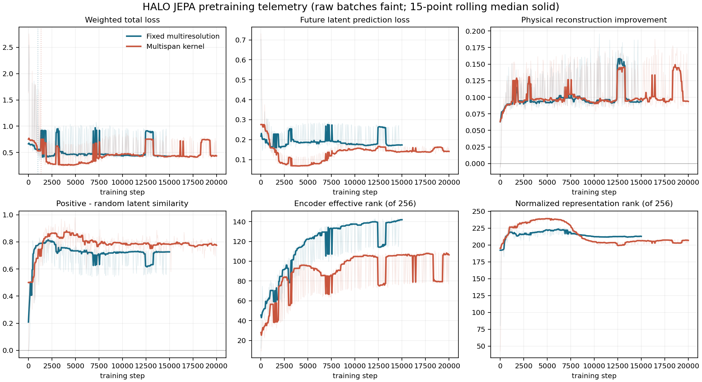

# HALO results record

This is the promoted result record for the current support-conditioned HAR design. Historical
Phase-B and movement-monitoring results are not mixed into this table.

## Sealed enrollment comparison - 2026-09-12

Both metrics are on a 0-100 scale and are averaged equally across the six sealed datasets. Accuracy
is the fraction of correct predictions within each dataset. Macro F1 gives every ground-truth class
equal weight within each dataset, regardless of its frequency. For every `k >= 1`, all rows use the
same parameter-free hard 1-NN classifier and the same deterministic,
execution-disjoint support/query manifests. `k` is the number of enrolled executions **per
candidate label**, so an episode with `C` candidates contains `C * k` supports. At `k=0`, no sealed
target recording is enrolled. HALO, HARNet, and LiMU-BERT-X instead use a labelled reference bank
built only from the eight classifier-training datasets: hard 1-NN predicts a training label and
ConSE bridges that prediction to the sealed candidate vocabulary. UniMTS and NormWear use their
released native text-aligned prediction paths.

"+ 5k tune" updates the encoder for 5,000 steps through the differentiable-neighbor objective;
the evaluation classifier still has no learned parameters. Parameter counts are measured from the
models actually loaded by the evaluation stack.

"Open-set labels" means that the deployed model can emit labels outside its classifier-training
vocabulary, either from labelled supports or through its semantic bridge. "Native adaptation"
means that the model itself accepts labelled examples at inference. Applying the common 1-NN
evaluator to an external encoder does not turn that encoder into a native adaptation model. The
explicit `k=0 readout` column prevents a shared ConSE bridge from being mistaken for a released
model's native capability.

### Macro F1

| model | parameters | open-set labels | native adaptation | k=0 readout | k=0 | k=1 | k=2 | k=4 | k=8 | k=16 | k=32 | k=64 | k=128 |
|---|---:|:---:|:---:|---|---:|---:|---:|---:|---:|---:|---:|---:|---:|
| HALO fixed multiresolution, JEPA + 5k tune | 3.22M | yes | yes | train-bank 1-NN + ConSE | 24.23 | 55.67 | 60.51 | 64.42 | 68.18 | 70.65 | 72.80 | 74.55 | 75.74 |
| HALO multispan kernel, JEPA + 5k tune | 2.71M | yes | yes | train-bank 1-NN + ConSE | 26.21 | **57.21** | **62.72** | **66.24** | 69.35 | 71.59 | 73.79 | 75.31 | 76.11 |
| HALO fixed 1 s, end-to-end neighbors 35k | **0.64M** | yes | yes | train-bank 1-NN + ConSE | 30.07 | 56.79 | 61.72 | 66.03 | **69.49** | **72.11** | **74.50** | **75.70** | **76.84** |
| HARNet, released | 4.49M | no | no | train-bank 1-NN + ConSE | **36.97** | 42.40 | 46.78 | 50.80 | 53.51 | 56.50 | 59.48 | 61.07 | 63.89 |
| LiMU-BERT-X, released | 0.055M | no | no | train-bank 1-NN + ConSE | 24.97 | 50.37 | 57.17 | 62.03 | 66.50 | 69.61 | 70.98 | 72.42 | 73.53 |
| UniMTS, released | 68.61M | yes | no | native zero-support | 31.61 | 56.08 | 61.73 | 66.22 | 68.83 | 71.44 | 72.92 | 74.05 | 75.57 |
| NormWear, released | 1,293.86M | yes | no | native zero-support | 5.14 | 21.90 | 24.68 | 28.39 | 31.71 | 35.51 | 39.15 | 41.61 | 44.89 |

### Accuracy

| model | k=0 | k=1 | k=2 | k=4 | k=8 | k=16 | k=32 | k=64 | k=128 |
|---|---:|---:|---:|---:|---:|---:|---:|---:|---:|
| HALO fixed multiresolution, JEPA + 5k tune | 30.94 | 55.77 | 60.83 | 64.74 | 68.47 | 70.85 | 73.10 | 74.83 | 76.00 |
| HALO multispan kernel, JEPA + 5k tune | 31.79 | **57.09** | **62.67** | **66.22** | 69.35 | 71.70 | 73.93 | 75.48 | 76.22 |
| HALO fixed 1 s, end-to-end neighbors 35k | 35.71 | 57.03 | 61.90 | 66.15 | **69.66** | **72.30** | **74.72** | **75.94** | **77.03** |
| HARNet, released | **41.07** | 43.56 | 47.75 | 51.46 | 53.98 | 56.78 | 59.56 | 61.09 | 63.82 |
| LiMU-BERT-X, released | 29.03 | 51.65 | 58.67 | 63.26 | 67.45 | 70.40 | 71.74 | 73.10 | 74.02 |
| UniMTS, released | 39.90 | 55.52 | 61.23 | 65.59 | 68.15 | 70.84 | 72.37 | 73.57 | 75.07 |
| NormWear, released | 15.95 | 22.42 | 25.15 | 28.86 | 32.12 | 35.97 | 39.68 | 42.06 | 45.50 |

Bold identifies the strongest score in each metric column, except where the bold parameter count
marks the smallest encoder. The fixed 1-second 35k checkpoint was trained before the present JEPA
study, but was rerun on the current six sealed datasets and current manifests. Its older published
eight-dataset score must not be substituted into these tables.

## Interpretation

- The compact 35k end-to-end fixed-filterbank encoder beats released UniMTS at k=1 and k=8 through
  k=128, ties it within 0.2 points at k=2 and k=4, and does so with about 0.64M versus 68.61M
  parameters. This is the strongest current encoder-only result.
- Among the new JEPA arms, the tuned multispan encoder is strongest. It beats UniMTS at every k in
  this table, but this comparison includes 5,000 supervised encoder-tuning steps for HALO.
- The JEPA arms require the 5,000-step enrollment-supervised tune to make this a deployed classifier;
  the table therefore does not present their earlier random/frozen diagnostic controls as model
  references.
- These are deployed-system comparisons, not parameter- or upstream-data-matched architecture
  ablations. The released models differ substantially in size and pretraining corpus.
- `k=0` does not mean an empty world model. It means zero target-dataset enrollment. The disclosed
  training-bank bridge lets representation-only models participate without fitting on a sealed
  recording, but it is not a native released zero-shot head. HARNet leads this condition at 36.97;
  among HALO variants, the fixed 1-second encoder is strongest at 30.07.

### Zero-target-enrollment results by sealed dataset

All entries are macro F1 on a 0-100 scale. The readout is identified in the main table.

| model | MotionSense | RealWorld | Shoaib | InclusiveHAR | USC-HAD | UT-Complex | equal-dataset mean |
|---|---:|---:|---:|---:|---:|---:|---:|
| HALO fixed multiresolution, JEPA + 5k tune | 31.16 | 26.90 | 34.31 | 20.75 | 15.11 | 17.15 | 24.23 |
| HALO multispan kernel, JEPA + 5k tune | 35.46 | 32.63 | 24.89 | 24.13 | 19.35 | 20.82 | 26.21 |
| HALO fixed 1 s, end-to-end neighbors 35k | 47.45 | 27.62 | 38.35 | 21.43 | 27.72 | 17.85 | 30.07 |
| HARNet, released | **54.22** | 26.64 | **48.07** | 28.31 | **29.27** | **35.29** | **36.97** |
| LiMU-BERT-X, released | 42.61 | 22.43 | 34.83 | 27.58 | 12.17 | 10.20 | 24.97 |
| UniMTS, released | 34.04 | **36.25** | 37.03 | **32.16** | 26.09 | 24.09 | 31.61 |
| NormWear, released | 7.09 | 4.85 | 3.58 | 8.60 | 4.85 | 1.86 | 5.14 |

## JEPA pretraining dynamics

The fixed multiresolution run completed 15,000 steps and the multispan-kernel run completed 20,000.
Both remained numerically healthy: no skipped mixed-precision updates, no future leakage, finite
inputs, nonzero gradients in the encoder and prediction/decoder modules, and no dead continuous
kernels. The curves use a rolling median because successive batches come from physically different
sources and their reconstruction scales differ.

- The future-prediction loss largely plateaus in the final quarter for both encoders. The fixed
  model's median falls from 0.184 in the first post-calibration quarter to 0.174 in the last; the
  kernel model ends near 0.142 after settling from its early transient.
- Physical reconstruction remains better than the zero-output baseline throughout. Its median
  improvement is stable at about 0.095 for the fixed model and 0.098 for the kernel model, rather
  than collapsing toward zero.
- Representation rank does not collapse. Encoder effective rank rises to about 142/256 for the
  fixed model and 110/256 for the kernel model; the normalized retrieval representation ends near
  213/256 and 208/256, respectively.
- These logs establish stable optimization and diminishing JEPA-objective gains, but they do not
  establish downstream overfitting. The in-run development-transfer fields are `NaN`, and only the
  final-step `best.pt` and `last.pt` checkpoints remain. There is therefore no valid intermediate
  classification curve from which to claim that representation quality peaked earlier.

The practical conclusion is that both schedules reached an objective plateau and neither shows a
collapse signature. More steps at the same learning-rate schedule are unlikely to produce a large
gain. The next run should retain periodic checkpoints and run the label-free development transfer
probe at those checkpoints; that is the evidence needed to select an earlier stopping point or
diagnose representation overfitting.

## Artifacts

Machine-readable and per-dataset results are under
`training/support_classifier/evaluations/jepa_representation_20260912/`. The relevant directories
for the promoted HALO rows are `fixed_jepa_adapted`, `multispan_jepa_adapted`, and
`fixed_e2e_35k_legacy_checkpoint`; external baseline artifacts are in `released_baselines` and
`training/support_classifier/outputs/sealed_limubert_x_20260912/`. The JEPA source telemetry is in
`training/tokenizer/outputs/jepa_fixed_multires_20260912_full/` and
`training/tokenizer/outputs/jepa_multispan_20260912_full/`.

Corrected zero-target-enrollment artifacts, including each six-dataset machine-readable result and
manifest, are under `training/support_classifier/evaluations/k0_training_bank_20260912/`. Training
reference features are cached separately under
`training/support_classifier/evaluations/zero_shot_feature_cache/`; no sealed feature is stored in
that bank.

No sealed result was used to select a checkpoint or tune an operating threshold.
